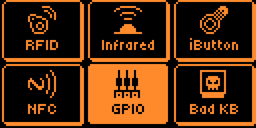
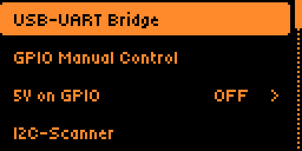
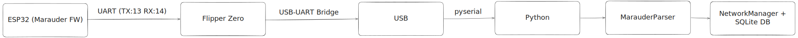

# FlipMarauder-WiFi
> **Automated Wi-Fi Reconnaissance & Logging Suite for Flipper Zero**

[](https://opensource.org/licenses/MIT)
[](https://www.python.org/)
[](https://flipperzero.one/)

<pre>
                                  ⠀⠀⠀⠀⠀⣀⣴⣿⣿⣿⣿⣿⣿⣿⣿⣿⣿⣿⣿⣿⣿⣿⣦⡢⡀⠀⠀⠀⠀
                                  ⠀⠀⠀⢄⣾⣿⣿⣿⣿⣿⣿⣿⣿⣿⣿⣿⣿⣿⣿⣿⣿⣿⣿⣿⣦⠀⠀⠀⠀
                                  ⠀⠀⢰⣿⣿⣿⣿⣿⣿⣿⣿⣿⣿⣿⣿⣿⣿⣿⣿⣿⣿⣿⣿⣿⣿⣧⠀⠀⠀
                                  ⠀⢨⣿⡿⢻⣿⣿⣿⣿⣿⣿⣿⣿⣿⣿⣿⣿⣿⣿⣿⣿⣿⣿⣿⣿⣿⣇⠀⠀
                                  ⠀⣼⣿⣿⣿⣿⣿⣿⣿⣿⣿⣿⣿⣿⣿⣿⣿⣿⣿⣿⣿⣿⣿⣿⣿⣿⣿⢀⠀
                                  ⢈⣿⣿⣿⣿⣿⣿⣿⣿⣿⣿⡇⠀⢹⣿⣿⣿⣿⣿⣿⣿⣿⣿⣿⣿⣿⣿⣾⠀
                                  ⠸⣿⣿⣿⣿⣿⣿⣿⣿⣿⡇⡇⠀⢸⢹⣿⣿⢿⣿⣿⣿⣿⣿⣿⣿⣿⣿⡧⠀
                                  ⠈⣿⣿⣿⣿⣿⠧⠯⠟⠿⠧⠀⠀⠀⠸⠿⠿⢼⣿⠿⢿⣟⣿⣿⣿⣿⣿⣇⠀
                                  ⠀⣿⣿⣿⣿⡿⢰⠺⣿⠉⠂⠀⠀⠀⠀⠀⠀⠚⣷⣶⠢⡀⢿⣿⣿⣿⡿⠉⠀
                                  ⢐⢻⣿⣏⠙⠇⠈⠒⠉⠁⠀⠀⠀⠀⠀⠀⠀⠀⠝⠻⠥⠁⢰⡌⠹⠋⡀⡀⠀
                                  ⠀⠉⢻⣿⣦⡀⠐⠂⠀⠀⠀⠀⠀⠀⠀⠀⠀⠀⠀⠀⠆⠄⠸⢃⣰⡀⠱⠀⠀
                                  ⠀⠀⠀⢹⣿⣿⡄⠀⠀⠀⠀⠀⠀⡀⡀⠀⠀⠀⠀⠀⠀⢀⣶⣿⣿⡟⠁⠀⠀
                                  ⠀⠀⠘⣸⢿⣿⣿⣦⡀⠀⠀⠀⠀⠠⠄⠀⠀⠀⠀⠀⣠⣾⣿⣿⣿⣇⠀⠀⠀
                                  ⠀⠀⠀⠉⠞⠿⠛⠿⠿⢶⣄⠀⠀⠀⠀⠀⠀⠀⣠⡾⠿⠿⣿⣿⡿⠅⠀⠀⠀
                                  ⠀⠀⠀⠀⠀⠀⠀⠀⠀⠈⣿⣿⣶⣤⣤⣤⡴⠊⠀⡧⠀⠀⣿⣿⣇⠀⠀⠀⠀
                                  ⠀⠀⠀⠀⠀⠀⠀⠀⣀⡞⠛⠿⣿⣿⠟⠋⠀⠀⠀⠱⣀⠈⣿⣿⡁⠀⠀⠀⠀
                                  ⠀⠀⠀⠀⠀⢠⡠⠔⠋⠀⠀⠀⠈⠁⠀⠀⠀⠀⠀⠀⠙⠲⣿⣧⠀⠀⠀⠀⠀
                                  ⢀⠔⠒⠀⠉⠀⠁⠀⠀⠀⠀⠀⠀⠀⠀⠀⠀⠀⠀⠀⠀⠀⠀⡿⠀⠉⠚⠤⢔
                                  
                                            FOREVERDOG          
                                        FLIPMARAUDER-WIFI       
</pre>

##  Overview
**FlipMarauder-WiFi** is a Python-based framework designed to bridge the gap between the Flipper Zero WiFi Marauder module and structured data analysis. It automates the process of capturing, parsing, and storing Wi-Fi network data in real-time.

Instead of squinting at a small screen or messy CLI logs, this tool provides a high-visibility dashboard and a persistent SQLite backend for your wardriving sessions.

##  Key Features
*  **Live Signal Monitoring:** Visualizes RSSI levels with real-time "signal bars" in your terminal.
*  **Automatic Data Persistence:** Every discovered Access Point (AP) is automatically logged into a SQLite database.
*  **Smart Parsing:** Robust RegEx-based parsing to handle different Marauder firmware outputs and hidden SSIDs.
*  **Hardware Transparency:** Utilizes the Flipper Zero as a stable USB-UART bridge, ensuring minimal data loss.

##  Hardware Requirements
1.  **Flipper Zero** (Running Momentum or official firmware).
2.  **ESP32 Wi-Fi Module V1 by Flipper Zero** flashed with [WiFi Marauder](https://github.com/justcallmecoco/ESP32Marauder).

##  Quick Start

### 1. Flipper Setup
- Connect your ESP32 module to the Flipper GPIO.
- Navigate to: `GPIO`.
  <p align="center">
  
</p>

- Navigate to: `USB-UART Bridge`
<p align="center">
  
</p>
  
- Set **Baudrate** to `115200`.
- Activate the bridge.

### 2. Installation
```bash
# Clone the repository
git clone [https://github.com/yourusername/FlipMarauder-WiFi.git](https://github.com/yourusername/FlipMarauder-WiFi.git)
cd FlipMarauder-WiFi
uv venv && source .venv/bin/activate  # or .venv\Scripts\activate on Win
uv pip sync requirements.txt
```

## Roadmap
<p align="center">
  
</p>

- GPS Sync: Mapping BSSIDs to physical locations.
- WiGLE Export: Native .csv generation for wardriving uploads.
- Handshake Capture: Automated deauth and handshake logging.

## Disclaimer

This software is for educational and authorized security testing only. The author is not responsible for illegal use or damage caused by this tool.
